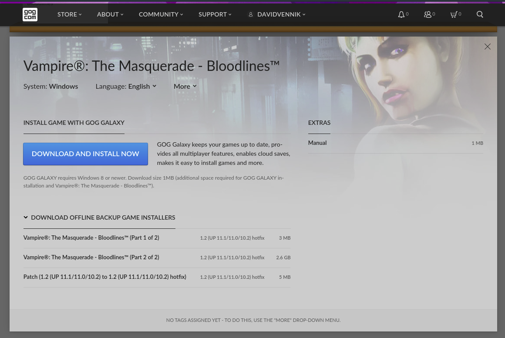

# vtmb

At the current time this is uploaded, the following screenshot is what you 
will see in your [gog.com](https://gog.com) account when you buy this:



Download this repository as a zip, unpack it, and copy the three files under 
"DOWNLOAD OFFLINE BACKUP GAME INSTALLERS" into it, which should be three 
files with the following names:

```
'patch_vampire_the_masquerade_-_bloodlines_1.2_(UP_11.111.010.2)_(54206)_to_1.2_(UP_11.111.010.2)_hotfix_(55110).exe'
'setup_vampire_the_masquerade_-_bloodlines_1.2_(up_11.111.010.2)_hotfix_(55110)-1.bin'
'setup_vampire_the_masquerade_-_bloodlines_1.2_(up_11.111.010.2)_hotfix_(55110).exe'
```

then execute the install script:

    ./vtmb_wine.sh

and it will install and make a desktop launcher icon for you that will work 
with gnome and probably most other linux desktop environments.

Please file an issue on this repository in case GOG makes an updated set of 
installer files, it will most likely mainly be the patches and will likely 
simply work just by changing filenames and recomputing their hashes. This 
works for now, as at 6 May 2022.

# Enjoy!